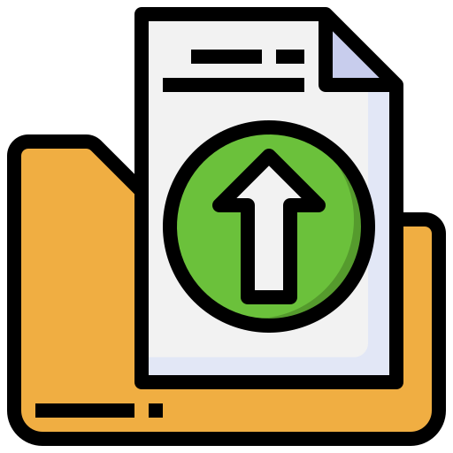

# 🥣 Granola Notes Exporter

  A clean, desktop GUI application built to parse and convert Granola-exported meeting notes (CSV) into beautifully formatted Markdown, Word (.docx), or PDF documents.  
  

## ✨ Features

- **Multi-Format Export:** Convert raw Granola CSV data into structured `.md`, `.docx`, or `.pdf` files.
- **Smart Directory Management:** Automatically creates output subfolders (`granola_markdown`, `granola_word_docs`, `granola_pdfs`) in your CSV's directory.
- **Cross-Platform:** Runs natively on macOS and Windows

## 🚀 Getting Started

### 🍏 macOS Installation

1. Go to the **[Releases Page](https://github.com/thatseanwalsh/GranolaExporter/releases)** and download `GranolaExporter-macOS.dmg`.
2. Double-click `GranolaExporter-macOS.dmg` to mount the disk image.
3. **Run directly (No installation required):** 
   - Double-click **Granola Exporter** right inside the mounted window to launch the app instantly.
4. *(Optional)* **Install permanently:** 
   - Drag **Granola Exporter** into the **Applications** folder shortcut in the window.

**First-time launch note:** Because this app is self-signed, macOS Gatekeeper may show a warning on first launch:
   - Control-click (or right-click) **Granola Exporter** in your Applications folder and select **Open**.
   - Click **Open** in the prompt. *(You only need to do this once).*

 

### 🪟 Windows Installation

1. Go to the **[Releases Page](https://github.com/thatseanwalsh/GranolaExporter/releases)** and download `GranolaExporter.exe`.
2. Double-click `GranolaExporter.exe` to run the app immediately—no installer required!

**First-time launch note:** Windows SmartScreen may show a *"Windows protected your PC"* prompt:
   - Click **More info**.
   - Click **Run anyway**.